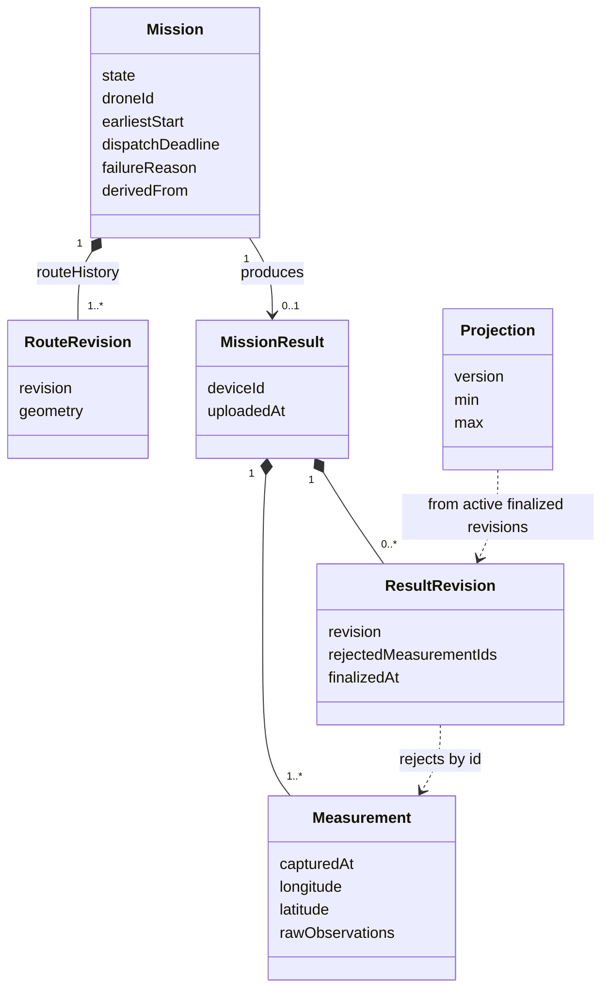
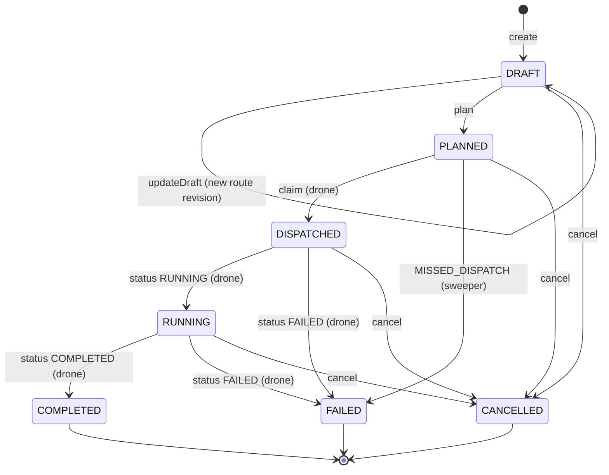
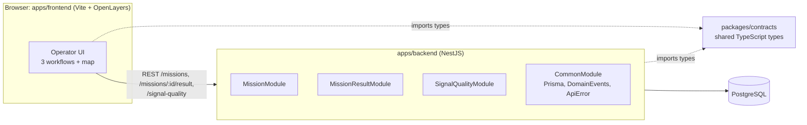
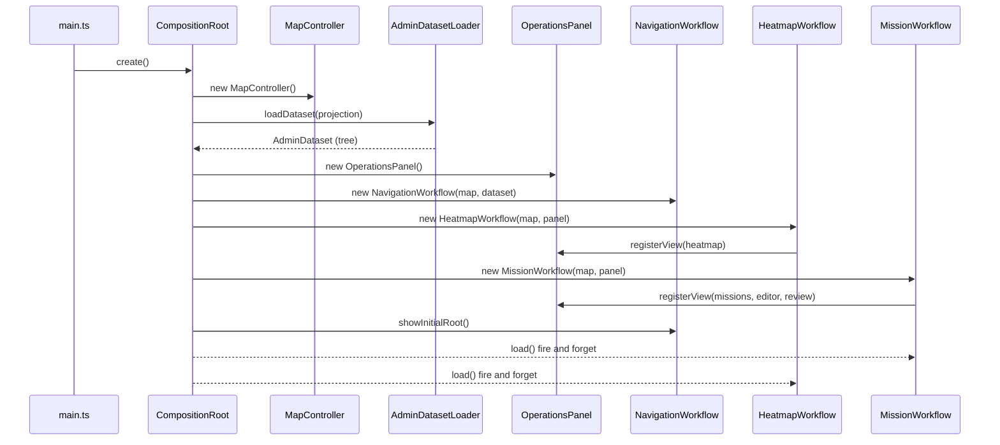
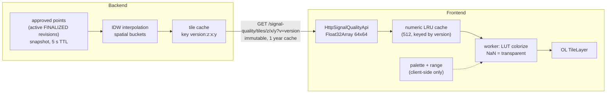

# Architecture diagrams

Mermaid overview diagrams that render directly on GitHub. They describe the code **as it is after the frontend refactor** (commits `refactor 1` to `refactor 5`).

- Detailed prose: [`architecture/frontend.md`](architecture/frontend.md), [`architecture/backend.md`](architecture/backend.md)
- Vocabulary: [`domain.md`](domain.md)
- Decisions: [`adr/`](adr/)
- Fine-grained PlantUML sources (class, sequence, state): [`uml/`](uml/), index at the bottom of this page

## 1. Domain overview

## 2. Mission lifecycle

A `FAILED` mission is never retried in place: `derive` creates a **new** `DRAFT` mission with `derivedFrom` pointing at the failed one. Result review and finalization do not change `MissionState`.

## 3. System boundaries

The browser only talks to the backend. Drones are **clients** of the backend (ADR-0003): the backend never opens a connection to a drone.

## 4. Frontend startup

## 5. KPI-tiles Pipeline

Colors, thresholds and opacity never cross the wire (ADR-0004). A palette edit re-colorizes from the numeric cache without any request.

## UML index (PlantUML)

| File                                                         | What it shows                                                     |
| ------------------------------------------------------------ | ----------------------------------------------------------------- |
| `uml/0001-platform-use-cases.puml`                           | Operator, drone and timer use cases (implemented vs planned)      |
| `uml/0002-core-domain-classes.puml`                          | Persisted, derived and concept-only domain types                  |
| `uml/0003-mission-execution-and-result-sequence.puml`        | Plan, execute, upload, review, finalize, explore                  |
| `uml/0004-frontend-component-boundaries.puml`                | Frontend components and allowed dependencies                      |
| `uml/0005-frontend-state-and-navigation.puml`                | Panel, editor-tool, navigation, heatmap and review state machines |
| `uml/0006-frontend-map-rendering-architecture.puml`          | Layers, interactions and renderer adapters on the map             |
| `uml/0007-frontend-mission-planning-sequence.puml`           | Create, edit and plan a mission                                   |
| `uml/0008-frontend-location-search-sequence.puml`            | Search, hover preview and commit                                  |
| `uml/0009-frontend-class-structure.puml`                     | Key classes and interfaces with collaborators                     |
| `uml/0010-frontend-startup-composition-sequence.puml`        | Composition root startup order                                    |
| `uml/0011-frontend-heatmap-tile-pipeline-sequence.puml`      | Range, tiles, palette edit and refresh                            |
| `uml/0012-frontend-result-review-and-finalize-sequence.puml` | Review, save and finalize end to end                              |
| `uml/0013-backend-module-structure.puml`                     | NestJS modules, events and infrastructure                         |
| `uml/0014-mission-lifecycle-states.puml`                     | Mission state machine with guards                                 |

Render with any PlantUML tool, for example `plantuml -tsvg docs/uml/*.puml`.
