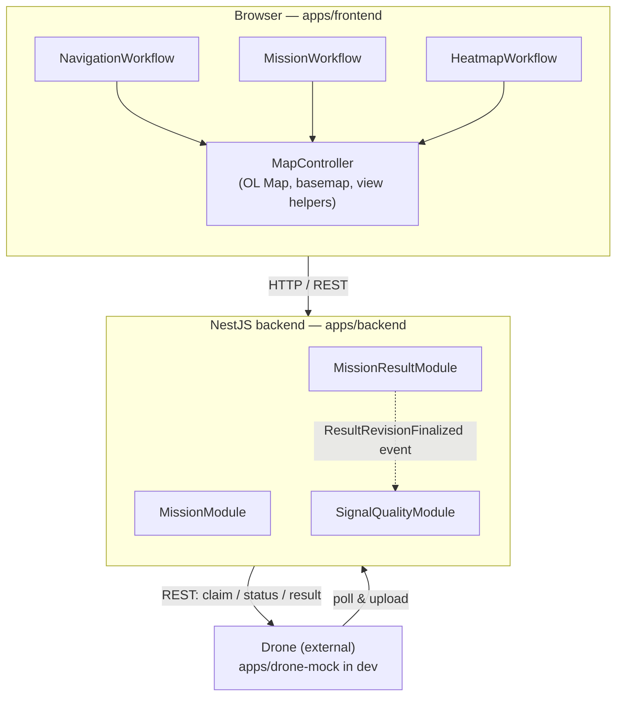
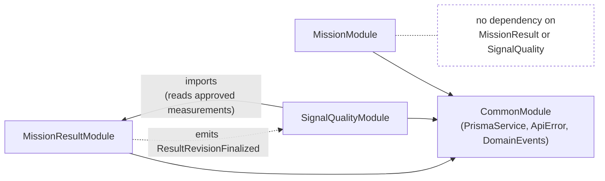
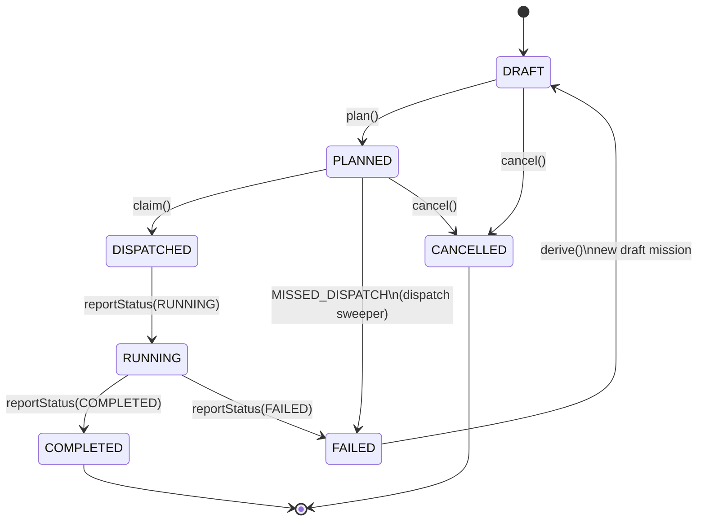
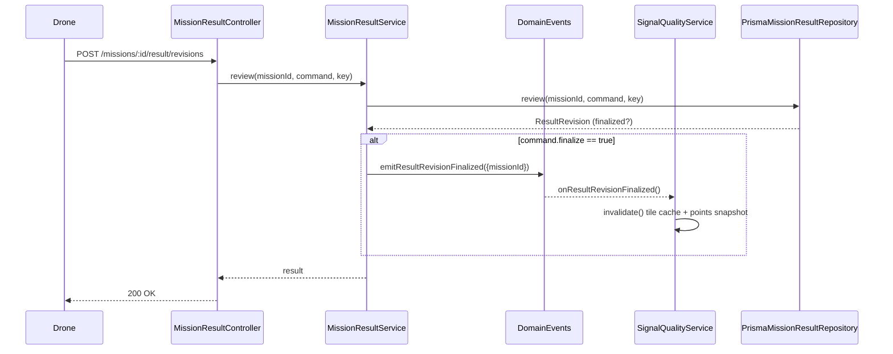
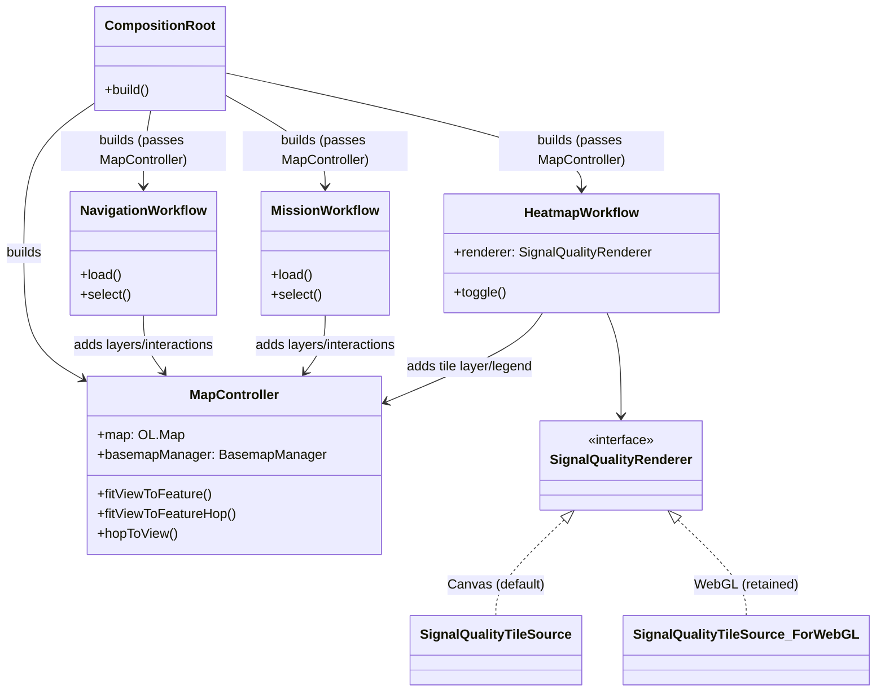

## Architecture

### 1. System boundaries

### 2. Backend module dependencies

### 3. Mission lifecycle

### 4. Result finalization → Signal Quality invalidation

### 5. Frontend composition and KPI rendering seam

